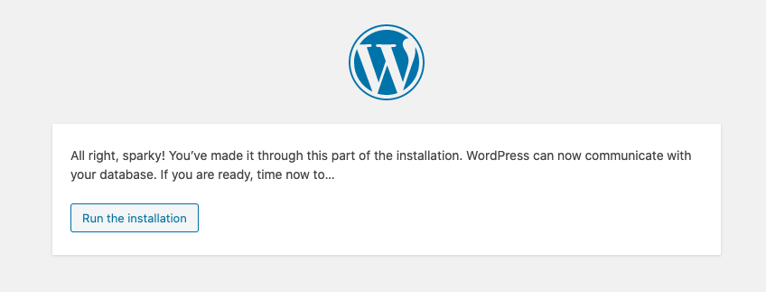

# Web Solution for Wordpress

Here are the steps I have followed

## Step -1 Prepare a Web Server 
1. Launch an EC2 instance with RedHat-OS that will serve as “Web Server”. 
2. In configuration details I attached three 1GB volumes to your Web Server EC2 instance and enabled TCP port 80 in inbound Rules config along with port 22.
3. SSH into the EC2 instance to begin configuration. 
4. Used `lsblk` command to view what block devices are attached to the server.  Since all devices in Linux are in the /dev/ directory, view it with `ls /dev/` to validate all 3 block devices are there. The names will likely be `xvdb`, `xvdc`, and `xvdd`.
5. Used `df-h` command to see all mounts and free space on the server.
6. Used `gdisk` utility to create a single partition on each of the 3 disks.

``` 
sudo gdisk /dev/xvdb
Command (? for help): n
Partition number (1-1218, default 1): 1
First sector (34-20971486, default = 2048) or {+-}size{KMGTP}: 
Last sector (2048-20971486, default = 20971486) or {+-}size{KMGTP}: 
Current type is 'Linux filesystem'
Hex code or GUID (L to show codes, Enter = 8300): 8e00              
Changed type of partition to 'Linux LVM'
...
OK; writing new GUID partition table (GPT) to /dev/xvdh.
The operation has completed successfully.
```
7. Used `lsblk` utility to view the newly configured partition on each of the 3 disks.
8. Installed `lvm2` package using `sudo yum install lvm2`. Run `sudo lvmdiskscan` command to check for available partitions.
9. Used `pvcreate` utility to mark each of 3 disks as physical volumes (PVs) to be used by LVM.

```
sudo wipefs -a /dev/xvdb && sudo pvcreate /dev/xvdb
sudo wipefs -a /dev/xvdc && sudo pvcreate /dev/xvdc
sudo wipefs -a /dev/xvdd && sudo pvcreate /dev/xvdd
```

10. Used `vgcreate` utility to add all 3 PVs to a volume group. Named the VG webdata-vg

```
sudo vgcreate webdata-vg /dev/xvdb /dev/xvdc /dev/xvdd
```

11. Verified that my VG was created successfully by running `sudo vgs`
12. Used `lvcreate` utility to create 2 logical volumes. apps-lv (Using half of the PV size), and logs-lv Use the remaining space of the PV size.

```
sudo lvcreate -n apps-lv -L 1.44g webdata-vg
sudo lvcreate -n logs-lv -L 1.44g webdata-vg
sudo lvs
```
13. Verified the entire setup

```
sudo vgdisplay -v #view complete setup - VG, PV, and LV
sudo lsblk 
```

14. Used `mkfs.ext4` to format the logical volumes with ext4 filesystem

```
sudo mkfs -t ext4 /dev/webdata-vg/apps-lv
sudo mkfs -t ext4 /dev/webdata-vg/logs-lv
```

15. Created /var/www/html directory to store website files
16. Created /home/recovery/logs to store backup of log data
17. Mounted /var/www/html on apps-lv logical volume

```
sudo mount /dev/webdata-vg/apps-lv /var/www/html/
```

18. Used `rsync` utility to backup all the files in the log directory /var/log into /home/recovery/logs. (This is necessary because all existing data on /var/log will be deleted once it is mounted.)

```
sudo rsync -av /var/log /home/recovery/logs
```

19. Mounted /var/log on logs-lv logical volume. 

```
sudo mount /dev/webdata-vg/logs-lv /var/log
```

20. Restored log files back into /var/log directory

```
sudo rsync -av /home/recovery/logs/log/ /var/log
```

21. Updated /etc/fstab file so that the mount configuration will persist after restart of the server

```
sudo vi /etc/fstab

#ADDED THESE 2 LINES
/dev/webdata-vg/apps-lv /var/www/html ext4     defaults,nofail   0   0
/dev/webdata-vg/logs-lv /var/log ext4     defaults,nofail   0   0
```

22. Verified setup by running df -h, output looks like this:


## Step 2 - Prepare the Database server
I launched a second RedHat EC2 instance that has a role of ‘DB Server’. I repeated the same steps as for the Web Server, but instead of `app-lv` I created `db-lv` and mounted it to `/db` directory instead of `/var/www/html/`.

## Step 3 - Install Wordpress on your Webserver EC2
I installed Wordpress and the other necessary packages:

```
sudo yum -y update
sudo yum -y install wget httpd php php-mysqlnd php-fpm php-json
cd /var/www/html
sudo wget http://wordpress.org/latest.tar.gz
sudo tar xzvf latest.tar.gz
cp -r wordpress /var/www/html
sudo systemctl enable http
```

## Step 4 - Install MySQL on your DB Server EC2

I installed and enabled MySQL

```
sudo yum update
sudo yum install mysql-server
sudo systemctl restart mysqld
sudo systemctl enable mysqld
```

## Step 5 - Configure DB to work with WordPress

```
sudo mysql
CREATE DATABASE wordpress;
CREATE USER `myuser`@`<Web-Server-Private-IP-Address>` IDENTIFIED BY 'mypass';
GRANT ALL ON wordpress.* TO 'myuser'@'<Web-Server-Private-IP-Address>';
FLUSH PRIVILEGES;
SHOW DATABASES;
exit
```

I edited the security group to open the MYSQL port 3306 also.  For extra security I allowed the DB server only from my Webserver's IP address, the Inbound Rule config was specifed as the DB private IP /32

## Step 6 - Configure WordPress to connect to remote database.

1. At the Webserver EC2 I install MySQL client and tested that I could connect from the Web Server to the DB server by using `mysql-client`

```
sudo yum install mysql
sudo mysql -u chauntel -p -h <DB-Server-Private-IP-address>
```

2. Then I verified that I could successfuly execute the `SHOW DATABASES`; command and saw a list of existing databases.
3. Next I changed the permission and configuration so Apache could use Wordpress.

```
sudo chown -R apache:apache /var/www/html/wordpress
sudo chcon -t httpd_sys_rw_content_t /var/www/html/wordpress -R
sudo setsebool -P httpd_can_network_connect=1
```

4. Test accessing from my browser the link to my WordPress `http://<Web-Server-Public-IP-Address>/wordpress/`
5. Filled out DB credentials


6. Saw message confirming Wordpress has sucessfully conntected to remote MYSQL database


